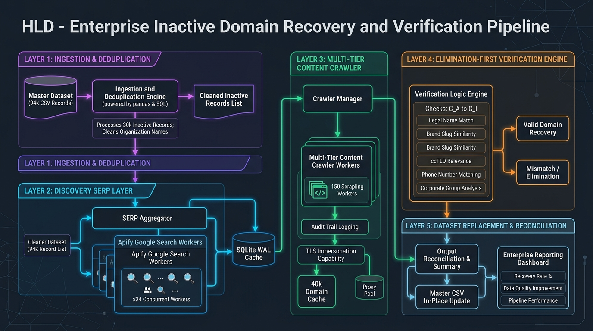
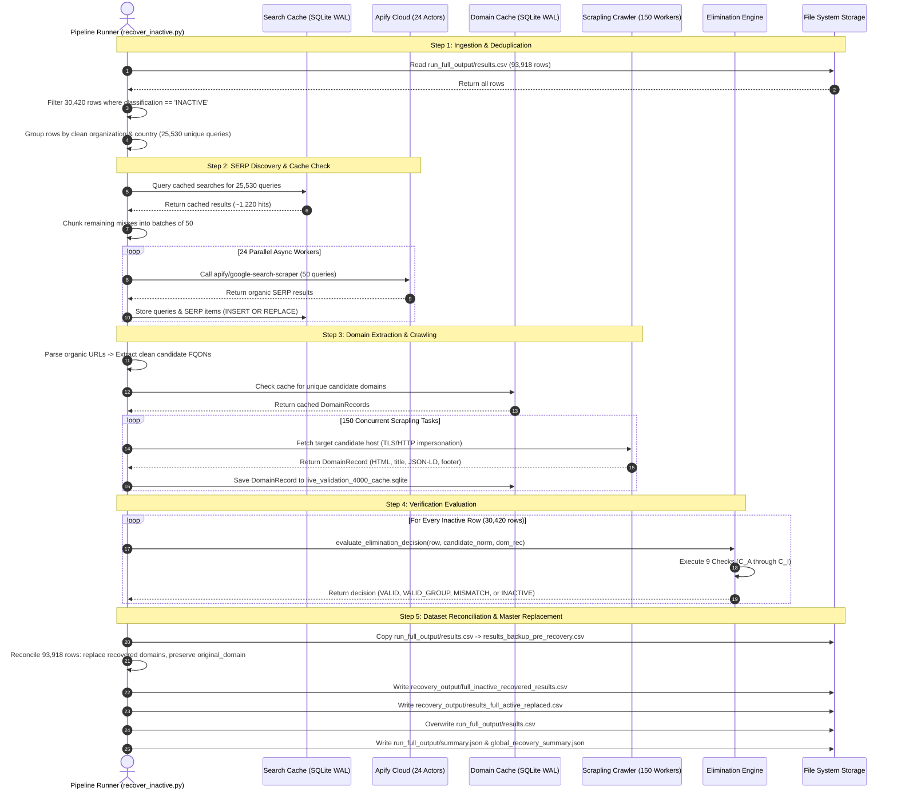
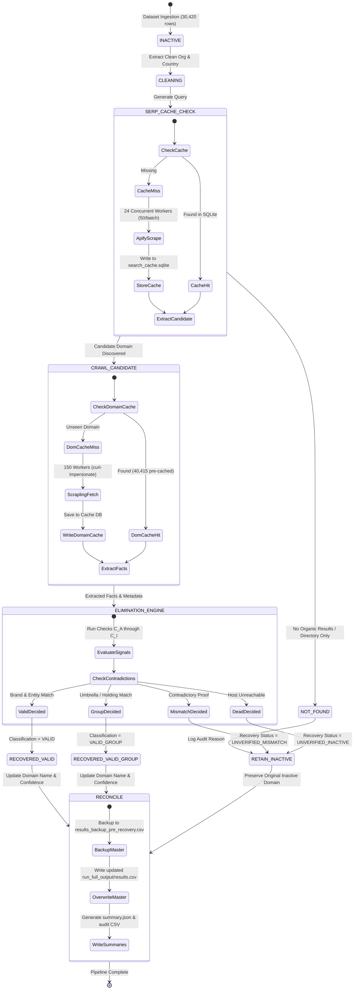

# High-Level Design (HLD) & Technical Architecture
## Inactive Domain Discovery, Elimination-First Verification & Dataset Replacement Pipeline

---

## 1. Executive Summary & Problem Context

In the enterprise master corporate verification dataset (`run_full_output/results.csv`, 93,918 records), **30,420 rows** were initially classified as `INACTIVE`. Inactive classifications stem from DNS resolution failures (`NXDOMAIN`), expired/parked domains, HTTP 410 (Gone) status codes, or obsolete corporate web addresses.

Rather than permanently discarding these organizations, the **Inactive Domain Discovery & Replacement Pipeline** autonomously searches for current official web footprints, crawls candidate web properties with high-throughput anti-bot unblocking, deterministically verifies corporate identity using an **Elimination-First Engine**, and reconciles the master dataset by replacing inactive URLs with active, high-confidence verified domains.

---

## 2. High-Level Design (HLD) Architecture Diagram



### Component Topology & Flow

```mermaid
flowchart TB
    subgraph Layer1 ["Layer 1: Ingestion, Partitioning & Deduplication"]
        direction TB
        M_IN["Master Results CSV<br>run_full_output/results.csv<br>(93,918 rows)"] --> FILT["Row Filter Engine<br>Predicate: classification == 'INACTIVE'"]
        FILT --> INACT["Inactive Partition Pool<br>(30,420 rows)"]
        INACT --> DEDUP["Corporate Entity Deduplicator<br>& Search Query Builder"]
        DEDUP -->|"Clean Org + Country<br>q = '{org}' {country} official website"| U_QUERIES["Unique Query Map<br>(25,530 unique queries)<br>1 Query -> [Row_1, Row_2, ... Row_N]"]
    end

    subgraph Layer2 ["Layer 2: SERP Discovery & Cache Subsystem"]
        direction TB
        U_QUERIES --> C_CHK{"Search Cache Lookup<br>(search_cache.sqlite)<br>PRAGMA journal_mode=WAL"}
        C_CHK -- "Cache Hit<br>(O(1) SQLite Query)" --> C_HIT["Cached SERP Items"]
        C_CHK -- "Cache Miss" --> DISP["Batch Dispatcher<br>(50 queries / chunk)"]
        
        DISP --> POOL["24 Concurrent Actor Workers<br>(asyncio.Semaphore = 24)"]
        POOL --> APIFY["Apify Cloud Platform<br>Actor: apify/google-search-scraper<br>Residential Proxies + SERP Engine"]
        APIFY --> RES_WRITE["Atomic Cache Writer<br>INSERT OR REPLACE INTO searches"]
        RES_WRITE --> C_HIT

        C_HIT --> EXTRACT["Candidate Domain Extractor<br>Filters Social, Directories, PDFs<br>Extracts Root FQDN"]
        EXTRACT --> CAND_MAP["Candidate Domain Mapping<br>Row ID -> Candidate Host"]
    end

    subgraph Layer3 ["Layer 3: Multi-Tier Content Crawling Subsystem"]
        direction TB
        CAND_MAP --> DOM_DEDUP["Domain Pool Deduplicator<br>(Unique Target Hosts)"]
        DOM_DEDUP --> D_CACHE{"Domain Cache Lookup<br>(live_validation_4000_cache.sqlite)<br>40,415 Pre-cached Records"}
        D_CACHE -- "Hit" --> DOM_REC["Cached DomainRecord"]
        D_CACHE -- "Miss" --> CRAWL_SEM["Crawler Semaphore<br>(concurrency = 150)"]
        
        CRAWL_SEM --> DNS_P["DNS Resolver & SSRF Probe<br>Detects NXDOMAIN & Private IPs"]
        DNS_P --> HTTP_FETCH["TieredFetcher Engine<br>Scrapling + curl-impersonate<br>Chrome/Safari TLS Fingerprinting"]
        HTTP_FETCH --> EXT_DOM["Structured Evidence Extractor<br>Title, H1, Meta, JSON-LD, Footer Legal Names"]
        EXT_DOM --> DOM_WRITE["Atomic Domain Cache Write<br>live_validation_4000_cache.sqlite"]
        DOM_WRITE --> DOM_REC
    end

    subgraph Layer4 ["Layer 4: Elimination-First Verification Engine"]
        direction TB
        CAND_MAP --> MERGE["Row & Candidate Merger"]
        DOM_REC --> MERGE
        MERGE --> ENGINE["Elimination-First Arbiter<br>verifier/elimination_engine.py"]

        subgraph Checks ["Deterministic Signal Verification Matrix"]
            direction LR
            CA["C_A: Search Rank"]
            CB["C_B: Legal Name"]
            CC["C_C: Brand Slug"]
            CD["C_D: Country TLD"]
            CE["C_E: Address"]
            CF["C_F: Phone Code"]
            CG["C_G: Email FQDN"]
            CH["C_H: Industry"]
            CI["C_I: Corporate Group"]
        end

        ENGINE --> Checks
        Checks --> DECIDE{"Elimination Arbiter Decision"}
        DECIDE -- "Brand/Legal Match Confirmed" --> RES_V["VALID (Confidence: HIGH)"]
        DECIDE -- "Parent Umbrella Confirmed" --> RES_VG["VALID_GROUP (Confidence: HIGH)"]
        DECIDE -- "Contradiction / Competing Entity" --> RES_M["MISMATCH (Retain INACTIVE)"]
        DECIDE -- "Target Host Unreachable" --> RES_I["INACTIVE (Retain INACTIVE)"]
        DECIDE -- "No SERP Result Found" --> RES_NF["NOT_FOUND (Retain INACTIVE)"]
    end

    subgraph Layer5 ["Layer 5: Reconciliation, Replacement & Output Generation"]
        direction TB
        RES_V & RES_VG --> RECOV_POOL["Recovered Pool<br>New Domain, Evidence & Confidence"]
        RES_M & RES_I & RES_NF --> UNRECOV_POOL["Unrecovered Pool<br>Preserve Original Inactive State"]

        RECOV_POOL & UNRECOV_POOL --> RECON["Master Dataset Reconciler<br>Match Key: input_row_id"]
        M_IN --> RECON

        RECON --> BKP["Immutable Safety Backup<br>run_full_output/results_backup_pre_recovery.csv"]
        RECON --> OUT_REPL["Master Updated Dataset<br>recovery_output/results_full_active_replaced.csv"]
        RECON --> OUT_LIVE["In-Place Live Master Update<br>run_full_output/results.csv"]
        RECON --> OUT_AUDIT["Inactive Recovery Audit Log<br>recovery_output/full_inactive_recovered_results.csv"]
        RECON --> OUT_SUM["Metrics & Health Summary<br>run_full_output/summary.json"]
    end

    Layer1 ==> Layer2
    Layer2 ==> Layer3
    Layer3 ==> Layer4
    Layer4 ==> Layer5

    style Layer1 fill:#0f172a,stroke:#38bdf8,stroke-width:2px,color:#f8fafc
    style Layer2 fill:#0f172a,stroke:#818cf8,stroke-width:2px,color:#f8fafc
    style Layer3 fill:#0f172a,stroke:#c084fc,stroke-width:2px,color:#f8fafc
    style Layer4 fill:#0f172a,stroke:#34d399,stroke-width:2px,color:#f8fafc
    style Layer5 fill:#0f172a,stroke:#fbbf24,stroke-width:2px,color:#f8fafc
```



---

## 3. End-to-End Sequence Diagram

The following sequence diagram details the runtime interaction between the pipeline orchestrator, external Apify actors, local caching tiers, the HTTP crawler, the Elimination Engine, and the file system.



---

## 4. Deep Component Specifications: What & How

### 4.1 Ingestion, Partitioning & Search Deduplication
- **What it does**: Ingests all 93,918 rows, extracts rows with `classification == "INACTIVE"`, normalizes company names, and eliminates redundant API calls.
- **How it works**:
  1. Filters input rows where `classification == "INACTIVE"`.
  2. Strips legal entity suffixes using compiled regex:
     ```python
     re.sub(r"\bCO[\.,\s]+(?:LTD|LIMITED)\b\.?", "", name, flags=re.I)
     re.sub(r"\b(?:PTE|PTY|SDN|BHD|LTD|LIMITED|INC|CORP|CORPORATION|LLC|GMBH|PLC|BV|AG|KK)\b\.?", "", name, flags=re.I)
     re.sub(r"\s*-\s*[A-Z]{2}$", "", name) # Country suffixes like - SG, - JP
     ```
  3. Maps Country Codes (`SG`, `MY`, `JP`, `TH`, `ID`, etc.) to their full geographic names (`Singapore`, `Malaysia`, `Japan`, etc.).
  4. Formats canonical search terms: `"{Clean Org}" {Country} official website`.
  5. Multi-row grouping: If 5 rows represent subsidiaries of the same parent company, all 5 rows point to a single query in `query_to_rows[q]`.

### 4.2 High-Throughput SERP Discovery Subsystem
- **What it does**: Submits search queries to Google via Apify without triggering anti-bot CAPTCHAs, capturing organic search rankings and descriptions.
- **How it works**:
  1. Employs `apify/google-search-scraper` configured for fast Cheerio-based SERP extraction (`maxPagesPerQuery: 1`, `resultsPerPage: 4`).
  2. **Worker Pool Concurrency**: Utilizes `asyncio.Semaphore(24)` allowing up to 24 cloud actor instances to execute concurrently.
  3. **Batch Sizing**: Bundles 50 search queries per actor call via newline delimiters (`queries: "q1\nq2\n..."`), processing up to 1,200 search queries in parallel.
  4. **Persistence Layer**: Every SERP result is committed immediately to SQLite (`verifier/search_cache.sqlite`) with Write-Ahead Logging (`PRAGMA journal_mode=WAL`) and a 60-second connection timeout, ensuring zero query loss if interrupted.

### 4.3 Candidate Domain Filtering & Normalization
- **What it does**: Identifies the true corporate homepage from organic results while rejecting third-party aggregators and directories.
- **How it works**:
  1. Iterates through organic results in SERP order.
  2. Rejects blacklisted domains:
     - Social networks (`linkedin.com`, `facebook.com`, `instagram.com`, `twitter.com`, `x.com`, `youtube.com`)
     - Enriched directories (`dnb.com`, `zoominfo.com`, `yellowpages.com`, `crunchbase.com`, `pitchbook.com`, `emis.com`)
     - Employment & review portals (`glassdoor.com`, `indeed.com`, `seek.com.au`, `jobstreet.com`)
     - Encyclopedias & app stores (`wikipedia.org`, `apple.com`, `play.google.com`)
  3. Rejects direct document paths terminating in `.pdf` or containing `/docs/`.
  4. Normalizes valid domains using RFC 3492 Punycode decoding and lowercase canonicalization.

### 4.4 Multi-Tier Web Crawling Subsystem (Scrapling)
- **What it does**: Concurrently fetches the homepage and contact pages of candidate websites while bypassing Cloudflare, Akamai, and AWS WAF protections.
- **How it works**:
  1. Checks `verifier/live_validation_4000_cache.sqlite` (which already contains 40,415 fetched domains).
  2. For cache misses, dispatches concurrent requests throttled by `asyncio.Semaphore(150)`.
  3. Uses **Scrapling** with `curl-impersonate` HTTP client to forge realistic TLS client hello fingerprints (JA3/JA4) matching Google Chrome 120 and Safari 17.
  4. Extracts DOM metadata: `<title>`, `<h1>`, `<meta description>`, OpenGraph tags, JSON-LD Schema.org entities (`Organization`, `Corporation`, `LocalBusiness`), and legal footer mentions.

### 4.5 The Elimination-First Verification Engine
- **What it does**: Rather than requiring difficult-to-find legal paperwork, the engine assumes a discovered corporate website is **VALID** unless concrete evidence contradicts the match.
- **How it works**: Evaluates candidate websites across 9 deterministic checks:

| Check | Signal | Decision Logic |
| :---: | :--- | :--- |
| **$C_A$** | Search Ranking | Verifies that search engine results associate the exact organization brand with the domain. |
| **$C_B$** | Organization Match | Tests for verbatim name match, legal entity match, or token overlap in `<title>`, `<h1>`, JSON-LD schema, or footer. |
| **$C_C$** | Brand Consistency | Assesses domain slug correspondence with the core brand token (e.g., `sony` in `sony.co.jp`). |
| **$C_D$** | Country Consistency | Confirms geographic alignment via ccTLD (`.jp`, `.my`, `.sg`, `.th`), physical address mention, or geo phone code. |
| **$C_E$** | Address Match | Verifies street address, postal code, or business park presence in the target jurisdiction. |
| **$C_F$** | Phone Dialing Code | Validates international dialing prefixes (`+60` MY, `+65` SG, `+81` JP, `+62` ID, `+66` TH). |
| **$C_G$** | Corporate Email FQDN | Ensures contact email addresses match the candidate domain. |
| **$C_H$** | Business Activity | Checks industry sector keywords against corporate descriptions. |
| **$C_I$** | Corporate Group Match | Identifies parent holding companies, subsidiaries, or shared corporate umbrella portals. |

#### Decision Rules:
- **`VALID`**: Assigned if $C_B$ is an exact/clean entity match OR if $C_C$ brand correspondence aligns with $C_D$ country/contact signals.
- **`VALID_GROUP`**: Assigned if the site belongs to an acknowledged corporate parent, holding company, or brand group umbrella.
- **`MISMATCH`**: Triggered only by active contradictory evidence (e.g., a commercial entity pointing to an unrelated personal blog, government portal, or completely unrelated business).
- **`INACTIVE`**: Retained if the newly discovered candidate domain is also dead, parked, or returns DNS errors.

### 4.6 Master Dataset Reconciliation & Replacement
- **What it does**: Reconciles the complete 93,918-row master dataset by replacing verified inactive domains in-place with zero data loss.
- **How it works**:
  1. Creates an immutable copy of `run_full_output/results.csv` to `run_full_output/results_backup_pre_recovery.csv`.
  2. Matches candidate evaluations against master rows using the unique `input_row_id` primary key.
  3. For every row where `recovery_status` is `RECOVERED_VALID` or `RECOVERED_VALID_GROUP`:
     - Updates `Domain Name` to the newly verified domain host.
     - Preserves the previous broken domain in `original_domain`.
     - Updates `classification` to `VALID` or `VALID_GROUP`.
     - Sets `confidence` to `HIGH`.
     - Appends extracted evidence URLs, page titles, and legal reasons.
  4. For rows where candidates were unverified or not found:
     - Preserves `Domain Name` and `INACTIVE` classification.
     - Adds `recovery_status = 'NOT_FOUND'` or `'UNVERIFIED_MISMATCH'` for full audit transparency.
  5. Computes updated global distribution metrics and writes `run_full_output/summary.json` and `recovery_output/global_recovery_summary.json`.

---

## 5. State Machine Diagram: Inactive Row Lifecycle



---

## 6. Output Artifacts & Deliverables Specification

| Artifact | File Path | Contents & Role |
| :--- | :--- | :--- |
| **Updated Master Dataset** | [`run_full_output/results.csv`](file:///Users/priteshhome/domain-verification/run_full_output/results.csv) | Full 93,918-row master dataset updated in-place with verified active domains replacing inactive entries. |
| **Pre-Recovery Backup** | [`run_full_output/results_backup_pre_recovery.csv`](file:///Users/priteshhome/domain-verification/run_full_output/results_backup_pre_recovery.csv) | Immutable snapshot of the dataset prior to recovery replacements. |
| **Standalone Recovered Dataset** | [`recovery_output/results_full_active_replaced.csv`](file:///Users/priteshhome/domain-verification/recovery_output/results_full_active_replaced.csv) | Standalone export of the unified 93,918-row dataset. |
| **Inactive Recovery Audit Log** | [`recovery_output/full_inactive_recovered_results.csv`](file:///Users/priteshhome/domain-verification/recovery_output/full_inactive_recovered_results.csv) | Detailed row-level audit records for all 30,420 inactive rows showing candidate discovered, checks triggered, and decision rationale. |
| **Global Metrics Summary** | [`run_full_output/summary.json`](file:///Users/priteshhome/domain-verification/run_full_output/summary.json) | Global metrics reflecting new verification rate, valid count, remaining inactive rows, and review counts. |
| **Recovery Summary** | [`recovery_output/global_recovery_summary.json`](file:///Users/priteshhome/domain-verification/recovery_output/global_recovery_summary.json) | Detailed breakdown of recovered rows, recovery rate percentage, and replacement totals. |
