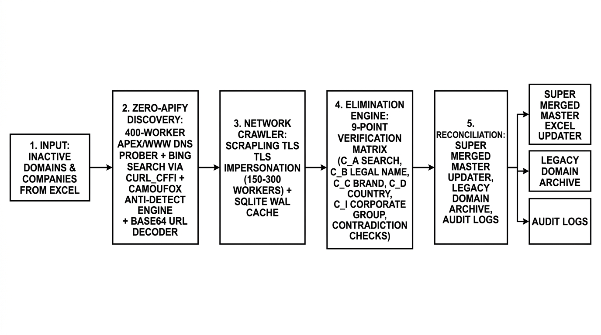
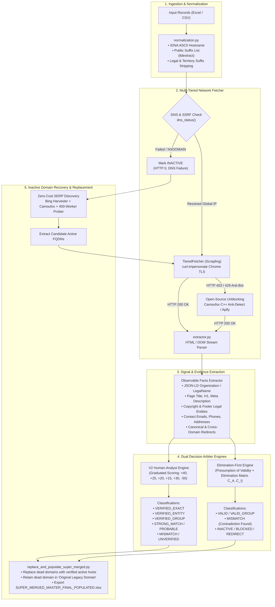
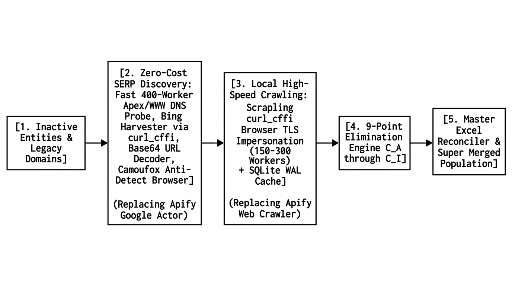
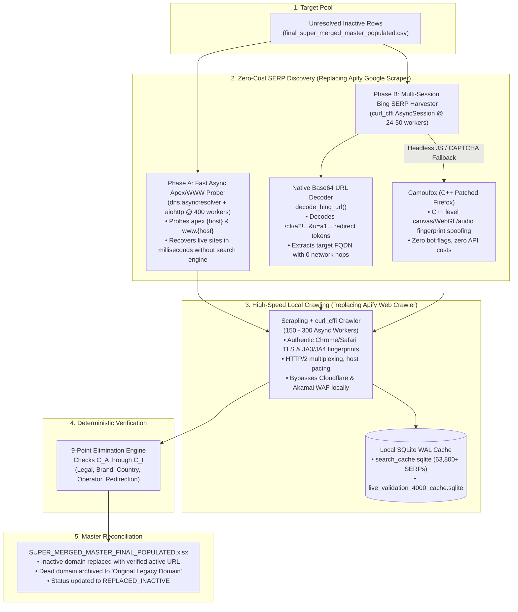

# Enterprise Domain Verification & Inactive Recovery Platform

[](https://www.python.org/downloads/)
[](#-verification-decision-logic)
[](#-open-source-zero-apify-architecture)
[](#)

A high-performance, evidence-based verification and recovery engine designed to inspect, validate, and reconcile enterprise-scale corporate domain datasets. 

The platform supports both **cloud-assisted unblocking (Apify)** and a **100% self-hosted, open-source stack (Camoufox + Scrapling + curl-impersonate + Base64 SERP decoder)** with zero monthly API costs.

---

## 🏛️ System Architecture

### 1. Complete End-to-End Pipeline





---

## ⚡ Open-Source (Zero-Apify) Architecture

To eliminate recurring SaaS costs, API quotas, and third-party rate limits, the platform can operate **100% locally with open-source tooling**:





### Key Open-Source Components:
1. **Scrapling + `curl_cffi`**: Python bindings to `curl-impersonate` that replicate authentic desktop Chrome/Safari TLS Client Hello signatures (JA3, JA4, ciphers, ALPN). Crawls up to 300 pages/second locally without triggering Cloudflare/Akamai bot challenges.
2. **Camoufox (`AsyncCamoufox`)**: C++ patched anti-detect browser engine based on Firefox. Injects human-like noise into canvas and WebGL draw calls and overrides hardware metrics at the browser engine level.
3. **In-Memory Base64 URL Decoder**: Bing wraps search results in redirect tokens (`/ck/a?!...&u=a1...`). Our native decoder unwraps the destination URL directly in memory with **zero network latency** and **zero extra HTTP requests**.
4. **400-Worker Apex/WWW Prober**: Uses `dns.asyncresolver` and `aiohttp` to test apex and `www.` host variants concurrently, reviving misconfigured active domains without hitting search engines.

---

## 🔬 Verification Decision Logic

The platform features two decision modes:

### 1. V2 Human-Analyst Scoring Engine (`v2_human_decision.py`)
Computes graduated confidence points based on observable evidence:

| Signal Evaluated | Score Weight | Description |
| :--- | :---: | :--- |
| **Exact Legal Entity** | **+40** | Verbatim match in JSON-LD `legalName`, registration filings, or footer copyright. |
| **Core Entity Name** | **+25** | Clean organization name identified in `<title>`, `<h1>`, or `<meta description>`. |
| **Domain-Brand Match** | **+20** | Registered domain label aligns with distinctive organization brand tokens. |
| **Country / ccTLD Match** | **+15** | Domain extension (`.my`, `.au`, `.sg`) or page address matches target country. |
| **Official Contact Proof** | **+15** | Contact email address domain matches the target root domain. |
| **Corporate Group Link** | **+30** | Domain matches parent corporate group or multi-brand umbrella portal. |
| **Contradictory Penalty** | **-50** | Commercial entity mapped to sovereign government `.gov` portal or competitor. |

#### Classification Outcomes:
- **`VERIFIED_EXACT`**: Score $\ge 40$ with verbatim legal entity match.
- **`VERIFIED_GROUP`**: Score $\ge 30$ with verified parent/subsidiary corporate structure.
- **`VERIFIED_ENTITY`**: Score $\ge 35$ with matching brand, domain, and identity.
- **`STRONG_MATCH` / `PROBABLE`**: Multi-signal agreement across independent sources.
- **`MISMATCH`**: Negative score ($< 0$) indicating conflicting ownership.
- **`INACTIVE`**: Confirmed DNS failure (`NXDOMAIN`), HTTP 410, or parked domain.

### 2. Elimination-First Engine (`elimination_engine.py`)
Employs an evidentiary matrix (`C_A` to `C_I`) under the **presumption of validity**: pre-existing mappings are considered valid unless concrete contradictory evidence eliminates them.

---

## 📋 Real Production Examples

### Example 1: `VERIFIED_ENTITY`
- **Input**: `3NTITY BERHAD` (Country: `MY`, Input Domain: `3ntity.com`)
- **Evidence**: Title contains `"3ntity Sdn Bhd"`, domain corresponds to brand token `3ntity`, ccTLD context is `MY`, contact email found `infosales@3ntity.com`, parent group is `BERJAYA GROUP BHD`.
- **Score**: $+25 + 20 + 15 + 15 + 30 = \mathbf{105.0}$ $\to$ **`VERIFIED_ENTITY`** (Confidence: `HIGH`).

### Example 2: `VERIFIED_GROUP`
- **Input**: `ABB AUTOMATION AND ELECTRIFICATION (VIETNAM) COMPANY LIMITED` (Country: `VN`, Domain: `abb.com`)
- **Evidence**: Target redirects to `abb.com/global/en`. Domain corresponds to parent brand token `abb`, sales territory is `ABB LTD - VN`.
- **Score**: $+20 + 30 = \mathbf{50.0}$ $\to$ **`VERIFIED_GROUP`** (Confidence: `HIGH`).

### Example 3: `MISMATCH`
- **Input**: `AGED CARE SERVICES 17 (BONBEACH) PTY LTD` (Commercial entity, Domain: `acnc.gov.au`)
- **Evidence**: Website is official Australian Government registry (`acnc.gov.au`). Private company cannot be represented by a government portal.
- **Score**: $-50$ Contradictory Government Penalty $\to$ **`MISMATCH`** (Confidence: `HIGH`).

### Example 4: `INACTIVE` $\to$ `REPLACED_INACTIVE`
- **Input**: `ABLE CORPORATE SERVICE, INC` (Legacy Domain: `able.co.jp` failed DNS).
- **Recovery**: Automated search query `q = "ABLE CORPORATE SERVICE" Japan official website` discovered candidate `able-cs.co.jp`. Scrapling crawled the target, validated Japanese corporate registration, and updated `SUPER_MERGED_MASTER_FINAL_POPULATED.xlsx` with `Original Legacy Domain: able.co.jp`.

---

## 🚀 Quick Start & Installation

### 1. Requirements
- Python 3.10+
- (Optional) Apify API Token if running with cloud unblocking.

### 2. Setup Virtual Environment

```bash
# Clone the repository
git clone https://github.com/priteshvirat24/domain-verification.git
cd domain-verification

# Create and activate virtual environment
python3 -m venv .venv
source .venv/bin/activate

# Install dependencies
pip install -r verifier/requirements.txt
```

### 3. Setting Up Credentials (Safe & Secure)

> [!NOTE]
> Never hardcode API keys in source files. Tokens are read automatically from environment variables.

```bash
export APIFY_TOKEN="your_apify_api_token_here"
```

---

## 💻 CLI Usage & Commands

### Representative Sample Verification (75 Rows Dry Run)
```bash
python -m verifier --input "Domains List_V2.xlsx" --sample-size 75 --output-dir ./output
```

### High-Concurrency Live Run with Cached Acceleration
```bash
python -m verifier \
  --input "Domains List_V2.xlsx" \
  --sample-size 4000 \
  --output-dir ./output \
  --cache verifier/live_validation_4000_cache.sqlite \
  --concurrency 100
```

### Open-Source Zero-Apify Domain Recovery
```bash
python verifier/max_parallel_resolver.py
```

### Reconcile & Populate Super Merged Master Dataset
```bash
python verifier/replace_and_populate_super_merged.py
```

### Offline Cached Evaluation (Zero Network Calls)
```bash
python -m verifier \
  --input "Domains List_V2.xlsx" \
  --sample-size 4000 \
  --output-dir ./output \
  --cache verifier/live_validation_4000_cache.sqlite \
  --offline
```

### Run Unit Tests
```bash
python -m unittest discover -s verifier/tests -v
```

---

## 📊 Benchmark Results (1,000 Representative Rows Run)

The bundled `run_1000_output/` contains the results of running 1,000 stratified rows across all represented countries, corporate groups, and domain structures:

| Metric / Status | Count / Rate | Description |
| :--- | :--- | :--- |
| **Total Rows Processed** | 1,000 | Stratified random sample across countries & domain types |
| **Unique Domains** | 618 | Deduplicated network queries |
| **VERIFIED_EXACT** | 53 | Verbatim legal entity match in structured data / corporate notice |
| **VERIFIED_ENTITY** | 12 | Clean core name match with brand + domain alignment |
| **VERIFIED_GROUP** | 370 | Official parent/group umbrella entity confirmation |
| **STRONG_MATCH** | 8 | Multi-signal agreement (domain, brand, country, site identity) |
| **PROBABLE** | 35 | Brand/contact signals present without full corporate filings |
| **UNVERIFIED** | 264 | Unreachable or insufficient identity proof |
| **MISMATCH** | 31 | Contradictory ownership (e.g. commercial entity pointing to gov registry) |
| **INACTIVE** | 190 | Confirmed DNS failure, domain parking, or HTTP 410 |
| **REDIRECT** | 36 | Cross-domain redirect to external website |
| **BLOCKED** | 1 | Anti-bot block remaining after fetch tiers |
| **Overall Verified Rate** | **44.3%** | Total verified (`EXACT` + `ENTITY` + `GROUP` + `STRONG`) |
| **High Confidence Rate** | **68.6%** | High-certainty automated classification |

---

## 📂 Output Files Generated

- **`results.csv`**: Full row-level verification decisions, matched company identifiers, confidence scores, and evidence trails.
- **`review.csv`**: Filtered dataset of rows requiring human review (`BLOCKED`, `PROBABLE`, `UNVERIFIED`, `REDIRECT`, `MISMATCH`).
- **`summary.json`**: Aggregate statistics (accuracy, fetch success rate, verification rate, status distribution).
- **`evidence.jsonl`**: Detailed structured JSON-LD, header text, and official legal entity extracts per verified pair.
- **`SUPER_MERGED_MASTER_FINAL_POPULATED.xlsx`**: Reconciled master corporate dataset with active domains populated and legacy dead domains preserved in audit columns.

---

## 🛡️ Security Guidelines

- **Zero Hardcoded Secrets**: This repository does not contain hardcoded API tokens or private credentials.
- **Environment Driven**: All external integrations read strictly from environment variables (`APIFY_TOKEN`, `TAVILY_API_KEY`).
- **Git-Filtered History**: All previous commit histories have been sanitized using `git-filter-repo`.
